# Hi there 👋 I'm David Sierra Porta
**Researcher | Professor | Data Scientist | Astrophysicist**

**🆔 About Me:** I'm a researcher and professor dedicated to the intersection of **Data Science, AI, and Astrophysics**. I specialize in deciphering complex patterns in spatial and environmental data through Machine Learning and Topological Data Analysis.  

**🧮🔭🔬 Areas of Interest:** Data science applied to astrophysics, space weather, and cosmic rays. Complex network analysis and topological data analysis. Environmental pollution modeling and climate change studies. Prediction of solar and geomagnetic events. AI applications in scientific research
- 🌌 **Astrophysics:** Space weather, cosmic rays, and solar event prediction.
- 🕸️ **Complex Systems:** Network analysis and topological modeling.
- 🌍 **Environment:** Climate change studies and pollution modeling.

**✅💻🔥 Technical Skills:**
Python (NumPy, Pandas, Scikit-Learn, TensorFlow, NetworkX, SciPy, Matplotlib). Machine learning and time series analysis. Spatial and geospatial data modeling. Scientific image analysis

> **Core Skills:** Time Series Analysis • Geospatial Modeling • Deep Learning • Scientific Computing

**📚 Projects & Publications:** I enjoy sharing code, methodologies, and scientific experiments in this repository. If you are interested in data science and its applications in various fields, take a look at my projects, and let's collaborate!

**🐚🐦‍🔥🚀 Let's Connect!** If you have an idea or would like to discuss data science and its applications, feel free to reach out. Always open to new collaborations!

**⚡ Fun Fact** 🍄 I'm a huge fan of **Tolkien's Legendarium**. As Gandalf said: *"All we have to decide is what to do with the time that is given us."* (I choose to spend mine training models and looking at the stars).

  
  

  
  

